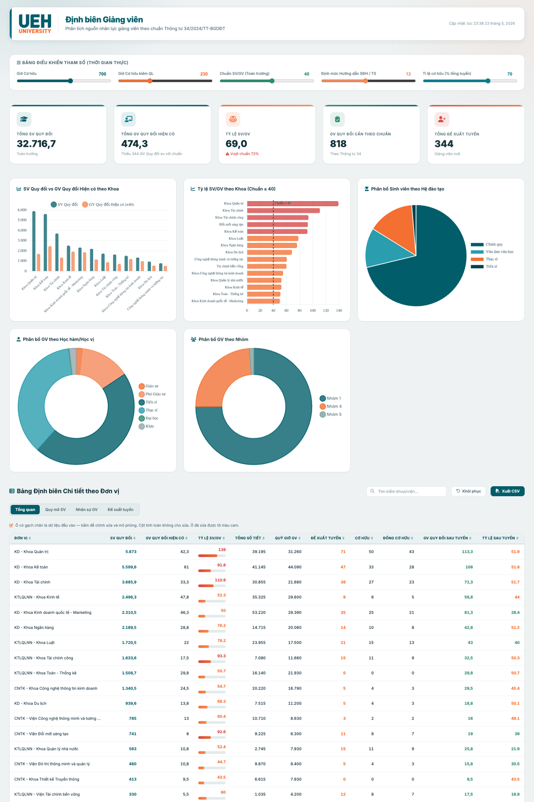
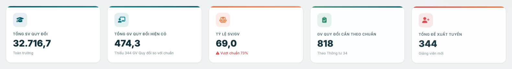
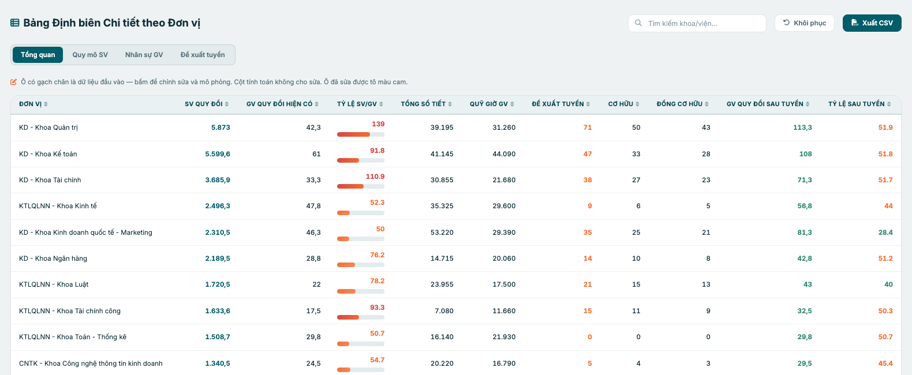
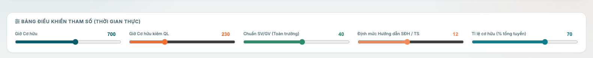
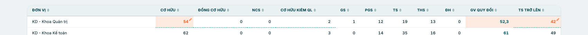
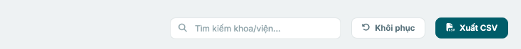

# HƯỚNG DẪN SỬ DỤNG
## Công cụ Định biên Giảng viên UEH 2026–2030

> Kính gửi Quý Thầy/Cô Lãnh đạo các Đơn vị,
>
> Tài liệu này hướng dẫn ngắn gọn cách dùng công cụ demo để **xem hiện trạng định biên** và **mô phỏng kịch bản tuyển dụng** cho đơn vị của mình.

**Truy cập:** <https://phultk-ueh.github.io/>

Mở bằng trình duyệt (Chrome / Edge / Safari). **Không cần đăng nhập, không cài đặt phần mềm.**

---

## Mục lục

1. [Bố cục trang dashboard](#1-bố-cục-trang-dashboard)
2. [Đọc số liệu định biên](#2-đọc-số-liệu-định-biên)
3. [Mô phỏng kịch bản tuyển dụng](#3-mô-phỏng-kịch-bản-tuyển-dụng)
4. [Câu hỏi thường gặp](#4-câu-hỏi-thường-gặp)
5. [Phụ lục: Công thức tính toán](#phụ-lục-công-thức-tính-toán)

---

## 1. Bố cục trang dashboard

Trang được chia thành 5 vùng (từ trên xuống):

| Số | Vùng | Vai trò |
|---|---|---|
| 1 | Header | Logo UEH + tên công cụ |
| 2 | Bảng điều khiển tham số | 5 thanh trượt để thử các giả định |
| 3 | 5 thẻ tổng quan | Số liệu toàn trường |
| 4 | Biểu đồ | So sánh trực quan theo khoa |
| 5 | Bảng chi tiết theo đơn vị | 4 tab — đây là vùng làm việc chính |

Cuối trang là phần **Tham số cấu hình** (hiển thị các hệ số đang dùng) và **Lưu ý quan trọng**.

---

## 2. Đọc số liệu định biên

### 2.1. 5 thẻ tổng quan toàn trường

| Thẻ | Ý nghĩa |
|---|---|
| **Tổng SV Quy đổi** | Tổng người học toàn trường, đã quy đổi theo hệ số TT34 |
| **Tổng GV Quy đổi Hiện có** | Tổng giảng viên hiện có, đã quy đổi theo nhóm + học vị |
| **Tỷ lệ SV/GV** | Số sinh viên trên 1 giảng viên quy đổi — chuẩn TT34 là **≤ 40** |
| **GV Quy đổi Cần theo chuẩn** | Số giảng viên tối thiểu phải có để đạt chuẩn 40 |
| **Tổng Đề xuất tuyển** | Số giảng viên còn thiếu so với chuẩn, cần tuyển bổ sung |

Nếu Tỷ lệ SV/GV vượt 40, thẻ sẽ hiển thị dòng **"Vượt chuẩn X%"** màu đỏ.

### 2.2. Bảng chi tiết theo đơn vị — 4 tab

Đây là **vùng làm việc chính**. Mỗi dòng là một khoa/viện. Bốn tab nhìn cùng dữ liệu ở 4 góc độ:

- **Tab "Tổng quan":** SV Quy đổi · GV Quy đổi · Tỷ lệ SV/GV · Tổng số tiết · Quỹ giờ · Đề xuất tuyển (tách Cơ hữu / Đồng cơ hữu) · GV Quy đổi sau tuyển · Tỷ lệ sau tuyển.
- **Tab "Quy mô SV":** số lượng sinh viên theo từng hệ đào tạo (CQ, VLVH, CTLK, ThS, TS) và tổng SV quy đổi của khoa.
- **Tab "Nhân sự GV":** số lượng giảng viên theo nhóm (Cơ hữu, Đồng cơ hữu, NCS, Cơ hữu kiêm QL) và theo học hàm/học vị (GS, PGS, TS, ThS, ĐH).
- **Tab "Đề xuất tuyển":** logic ra số gồm *Thiếu để dạy* (theo giờ giảng), *Khuyến nghị TS* (theo nhu cầu hướng dẫn SĐH), *Tuyển cục bộ*, *Bù chuẩn toàn trường*, **TỔNG TUYỂN** và tách Cơ hữu/Đồng cơ hữu.

---

## 3. Mô phỏng kịch bản tuyển dụng

Công cụ cho phép trả lời câu hỏi: *"Nếu khoa tôi tăng thêm X sinh viên / thêm Y giảng viên / Bộ đổi chuẩn thành 35 — thì cần tuyển bao nhiêu?"*

Có **2 cách điều chỉnh**, mọi thay đổi đều được dashboard tính lại tức thì.

### 3.1. Kéo thanh trượt tham số (đầu trang)

| Thanh trượt | Ý nghĩa | Mặc định |
|---|---|--:|
| Giờ Cơ hữu | Định mức giờ giảng/năm của GV cơ hữu | 700 |
| Giờ Cơ hữu kiêm QL | Định mức của GV kiêm nhiệm quản lý | 230 |
| Chuẩn SV/GV | Tỷ lệ tối đa theo TT34 | 40 |
| Định mức Hướng dẫn SĐH/TS | 1 Tiến sĩ hướng dẫn tối đa bao nhiêu học viên SĐH | 12 |
| Tỉ lệ cơ hữu (% tổng tuyển) | Tỷ trọng cơ hữu trong số đề xuất tuyển | 70% |

Mỗi lần kéo slider, dashboard tự tính lại. Hữu ích khi muốn so sánh *"Nếu Bộ siết chuẩn về 35 thì cần tuyển thêm bao nhiêu?"*.

### 3.2. Chỉnh sửa số liệu trong bảng và Khôi phục

#### a) Nhận diện ô

- **Ô có gạch chân teal:** là ô đầu vào, bấm vào sửa được.
- **Ô không gạch chân:** là ô tính toán, KHÔNG sửa được.
- Chỉ tab **Quy mô SV** và **Nhân sự GV** mới có ô sửa.

#### b) Cách sửa

1. Bấm vào ô có gạch chân.
2. Gõ số mới (vd thay 600 thành 800).
3. Bấm `Enter` hoặc click ra ngoài, **toàn dashboard tự tính lại tức thì**.
4. Ô đã sửa sẽ **chuyển nền màu cam** để dễ nhận diện.

**Quy tắc tự cập nhật liên quan** (tab Nhân sự GV):
- Khi tăng/giảm **Cơ hữu, Đồng cơ hữu, NCS, Cơ hữu kiêm QL**, cột **GV Quy đổi sẽ tự cộng/trừ theo hệ số quy đổi GV của nhóm đó**.
- Mặc định **mỗi nhân sự thêm vào = thêm 1 người trình độ Tiến sĩ trở lên** (vì tuyển mới ưu tiên TS). NCS không tính vào TS trở lên.

Tương tự, ở tab Quy mô SV, khi sửa số sinh viên thì SV Quy đổi tự nhân lại với hệ số tương ứng.

#### c) Khôi phục số liệu gốc

Bấm nút **"Khôi phục"** ở góc phải trên bảng để đưa mọi ô đã sửa quay về số ban đầu (dấu cam biến mất). An toàn 100% — bạn không làm hỏng dữ liệu trên server.

> *Lưu ý:* mô phỏng chỉ lưu trong phiên đang mở. Tải lại (F5) trang sẽ tự về số gốc (đây là chủ ý, để tránh lệch giữa các người dùng).

---

## 4. Câu hỏi thường gặp

**Q1: Tôi muốn xem khoa tôi cần tuyển bao nhiêu TS?**
**Đáp:** Mở tab **Đề xuất tuyển**, cột *Khuyến nghị TS* là số TS cần thêm để hướng dẫn SĐH. Cột *TỔNG TUYỂN* là tổng tuyển bao gồm cả nhu cầu giờ giảng.

**Q2: Tôi muốn thử "nếu khoa A có thêm 100 NCS vào 2028"?**
**Đáp:** Mở tab **Quy mô SV**, dòng khoa A, ô TS (NCS) — sửa thành giá trị mới. Đè Enter. Cột *Khuyến nghị TS* trong tab Đề xuất tuyển sẽ tăng tương ứng.

**Q3: Tôi muốn về số gốc?**
**Đáp:** Bấm nút **Khôi phục**.

**Q4: Số trên thẻ tổng quan và tổng cộng trong bảng có lệch không?**
**Đáp:** Hai nguồn này luôn khớp. Nếu thấy lệch (~80%), đó là **đang trong animation đếm số khi mở trang** — đợi 1–2 giây sẽ về số đúng.

**Q5: Có cảnh báo về tỷ lệ giảng viên nước ngoài 5% không?**
**Đáp:** Phiên bản demo này **chưa tích hợp** kiểm tra ràng buộc đó. Sẽ bổ sung ở bản sau.

**Q6: Tôi đóng tab và mở lại, các thay đổi của tôi còn không?**
**Đáp:** Không — mô phỏng chỉ lưu trong phiên đang mở. Reload trang sẽ về số gốc.

---

## Phụ lục: Công thức tính toán

**Công thức tính giảng viên quy đổi:**

> **Hệ số quy đổi GV = hệ số phân nhóm × hệ số học hàm/học vị**

- **Hệ số phân nhóm:** Cơ hữu = 1.0 · Đồng cơ hữu = 0.5 · Cơ hữu kiêm QL = 1.0 · NCS = 1.0
- **Hệ số học hàm/học vị:** GS / PGS / TS = 1.0 · ThS = 0.75 · ĐH / Khác = 0.5
- **NCS toàn thời gian:** học vị được chuẩn hóa về ThS (0.75), suy ra hệ số quy đổi GV = 1.0 × 0.75 = **0.75**; không tính giờ dạy.
- **Đồng cơ hữu:** quỹ giờ 350 tiết/năm (= 50% cơ hữu).

**Hệ số quy đổi sinh viên:** CQ 1.0 · VLVH 0.8 · CTLK 0.75 · ThS 1.5 · TS 2.0.

**Định mức hướng dẫn SĐH:** 1 TS hướng dẫn tối đa 12 học viên (= 6 học viên/năm × 2 năm đào tạo).

**Bù chuẩn toàn trường:** sau khi tính tuyển cục bộ từng khoa, nếu tỷ lệ SV/GV toàn trường vẫn > 40 thì hệ thống lặp rót thêm chỉ tiêu vào khoa có tỷ lệ SV/GV cao nhất cho đến khi đạt chuẩn ≤ 40.

---

## Liên hệ hỗ trợ

Mọi thắc mắc về cách dùng hoặc số liệu, vui lòng phản hồi qua email cho HOD.

> *Phiên bản tài liệu: 2026.05 — Demo công cụ định biên giảng viên UEH theo Thông tư 34/2026/TT-BGDĐT.*
